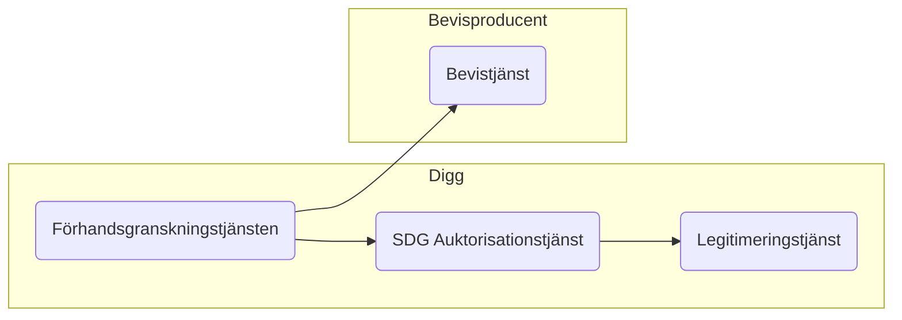
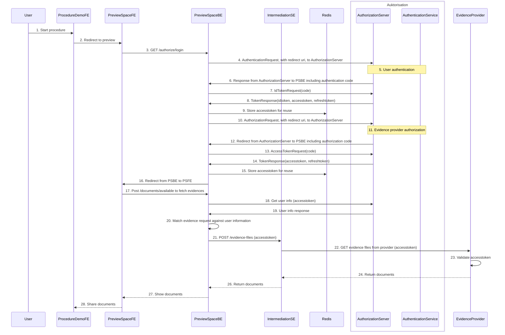

# SDG Bevisdelning, inom det tekniska systemet för bevisutbyte
Här finns beskrivningen av API:et intermediationSE vilket är det API som svenska bevisproducenter implementerar, för att via Diggs förhandsgranskningstjänst, låta en användare dela bevis via det tekniska systemet för bevisutbyte (OOTS).

[Open-API-specen finns här](https://diggsweden.github.io/sdg-intermediation-se/)

För frågor om API:et, hör av er till [oss](mailto:sdg@digg.se)

## Bevisdelning och förhandsgranskning, översiktligt flöde

### Flödesbeskrivning
1. Förhandsgranskningstjänsten återautentiserar andvändaren mha SDG auktorisationstjänst som i sin tur nyttjar legitimeringstjänsten Sweden Connect.
2. En lyckat autentisering ger förhandsgranskningstjänsten ett åtkomstintyg (accesstoken) som skickas med till bevisproducentens bevistjänst. 
3. Med hjälp av åtkomstintyget auktoriserar bevisproducenten API-anropet och lämnar ett bevissvar till förhandsgranskningstjänsten där användaren avgör om beviset ska delas och föras över för vidare användning i sitt pågående förfarande. 

## Bevisdelning och förhandsgranskning, detaljerat flöde

### Flödesbeskrivning
1. Användaren besöker förfarandet och förbereder en bevisbegäran
2. Användaren initierar autentisering
3. Användaren väljer att logga in och initierar legitimeringsförfrågan
4. PreviewSpaceBE bygger ihop och skickar ett authentication request till AuthorizationServer, samtidigt blir användaren omdirigerad till id-tjänsten
5. Användaren legitimerar sig i id-tjänsten
6. AuthorizationServer svarar förbestämd callback endpoint med en authentication code
7. PreviewSpaceBE bygger ihop och skickar ett idtoken request till AuthorizationServer
8. Authorization svarar med idtoken, accesstoken, refreshtoken.
9. PreviewSpaceBE sparar ner accesstoken i redis.
10. PreviewSpaceBE bygger ihop och skickar ett authorization request till AuthorizationServer
11. Auktorisering av klient
12. AuthorizationServer svarar förbestämd callback endpoint med en authorization code
13. PreviewSpaceBE bygger ihop och skickar ett accesstoken request
14. AuthorizationServer svarar med accesstoken och refreshtoken
15. PreviewSpaceBE sparar ner accesstoken i redis
16. Användaren blir omdirigerad tillbaka till PSFE
17. Bevishämtning initieras
18. PreviewSpaceBE skickar en förfrågan till AuthorizationServer för att hämta användarinformation
19. AuthorizationServer svarar med användarinformation
20. PreviewSpaceBE matchar information från evidence request mot användarinformationen.
21. PreviewSpaceBE skickar förfrågan, som innehåller accesstoken, för bevishämtning till IntermediationSE
22. IntermediationSE skickar förfrågan, som innehåller accesstoken, till bevisproducent
23. Bevisproducent validerar accesstoken
24. Bevisproducent returnerar IntermediationSE med bevis
25. IntermediationSE returnerar bevis till PreviewSpaceBE
26. PreviewSpaceBE returnerar bevis till PreviewSpaceFE som visar upp hämtade bevis för användaren.
27. Användare väljer att dela bevis med förfarande

