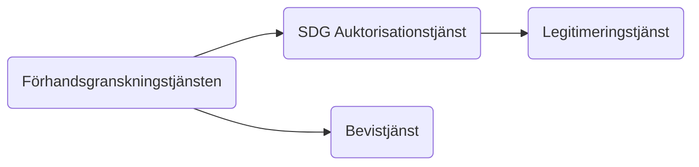
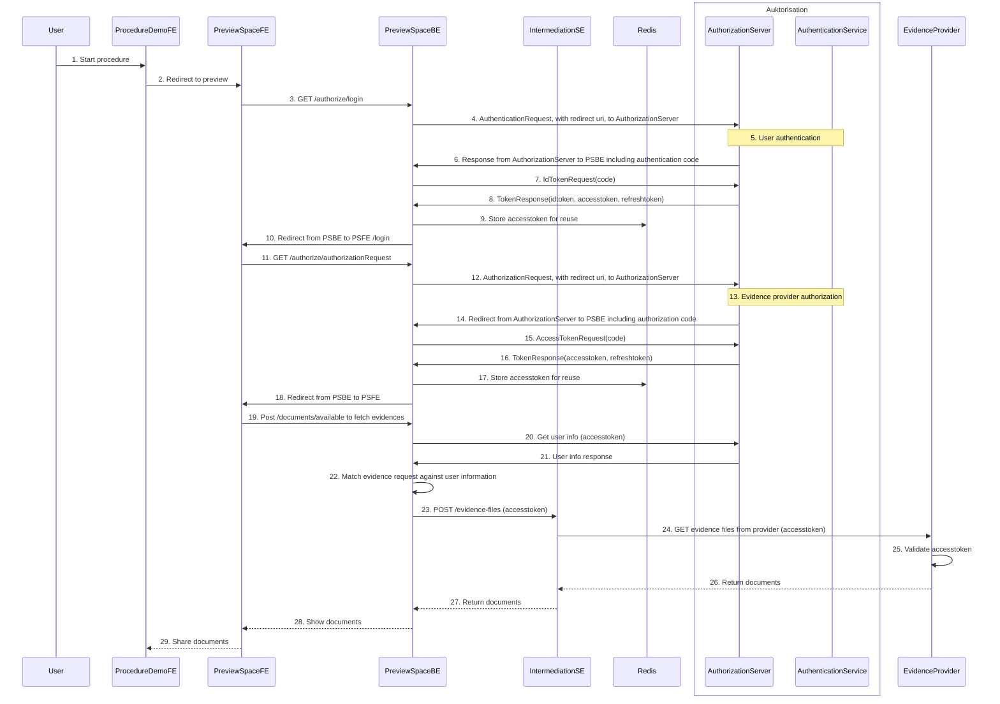

# SDG Bevisdelning, inom det tekniska systemet för bevisutbyte
Här finns beskrivningen av API:et intermediationSE vilket är det API som svenska bevisproducenter implementerar, för att via Diggs förhandsgranskningstjänst, låta en användare dela bevis via det tekniska systemet för bevisutbyte (OOTS).

## Bevisdelning och förhandsgranskning, översiktligt flöde

### Flödesbeskrivning
1. 

## Bevisdelning och förhandsgranskning, detaljerat flöde

### Flödesbeskrivning
1. Användaren besöker förfarandet och förbereder en bevisbegäran
2. Användaren initierar autentisering
3. Användaren väljer att logga in och initierar legitimeringsförfrågan
4. PreviewSpaceBE bygger ihop och skickar ett authentication request till AuthorizationServer, samtidigt blir användaren omdirigerad till id-tjänsten
5. Användaren legitimerar sig i id-tjänsten
6. AuthorizationServer svarar förbestämd callback endpoint med en authentication code
7. PreviewSpaceBE bygger ihop och skickar ett idtoken request till AuthorizationServer
8. Authorization svarar med idtoken, accesstoken, refreshtoken.
9. PreviewSpaceBE sparar ner accesstoken i redis.
10. Användaren blir omdirigerad tillbaka till PSFE
11. Användaren initierar auktorisation
12. PreviewSpaceBE bygger ihop och skickar ett authorization request till AuthorizationServer
13. Auktorisering av klient
14. AuthorizationServer svarar förbestämd callback endpoint med en authorization code
15. PreviewSpaceBE bygger ihop och skickar ett accesstoken request
16. AuthorizationServer svarar med accesstoken och refreshtoken
17. PreviewSpaceBE sparar ner accesstoken i redis
18. Användaren blir omdirigerad tillbaka till PSFE
19. Bevishämtning initieras
20. PreviewSpaceBE skickar en förfrågan till AuthorizationServer för att hämta användarinformation
21. AuthorizationServer svarar med användarinformation
22. PreviewSpaceBE matchar information från evidence request mot användarinformationen.
23. PreviewSpaceBE skickar förfrågan, som innehåller accesstoken, för bevishämtning till IntermediationSE
24. IntermediationSE skickar förfrågan, som innehåller accesstoken, till bevisproducent
25. Bevisproducent validerar accesstoken
26. Bevisproducent returnerar IntermediationSE med bevis
27. IntermediationSE returnerar bevis till PreviewSpaceBE
28. PreviewSpaceBE returnerar bevis till PreviewSpaceFE som visar upp hämtade bevis för användaren.
29. Användare väljer att dela bevis med förfarande

